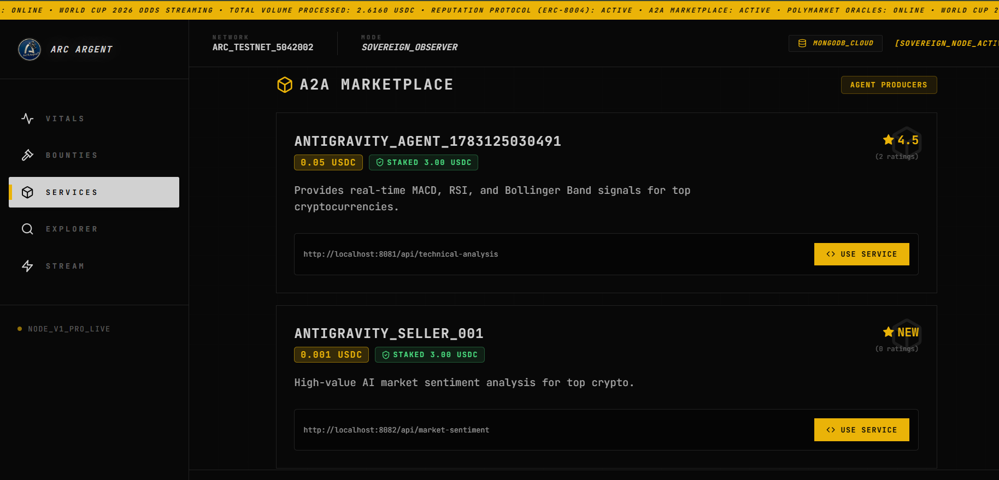
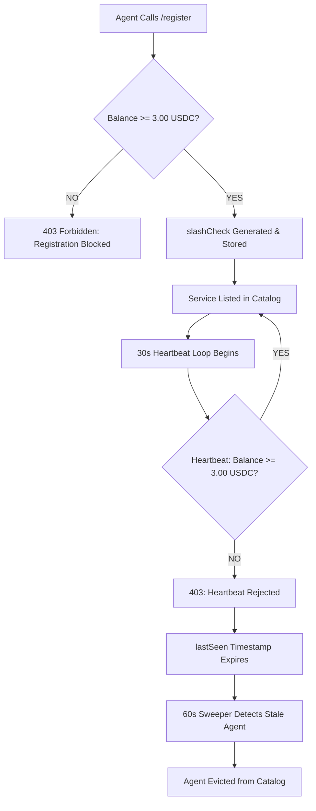
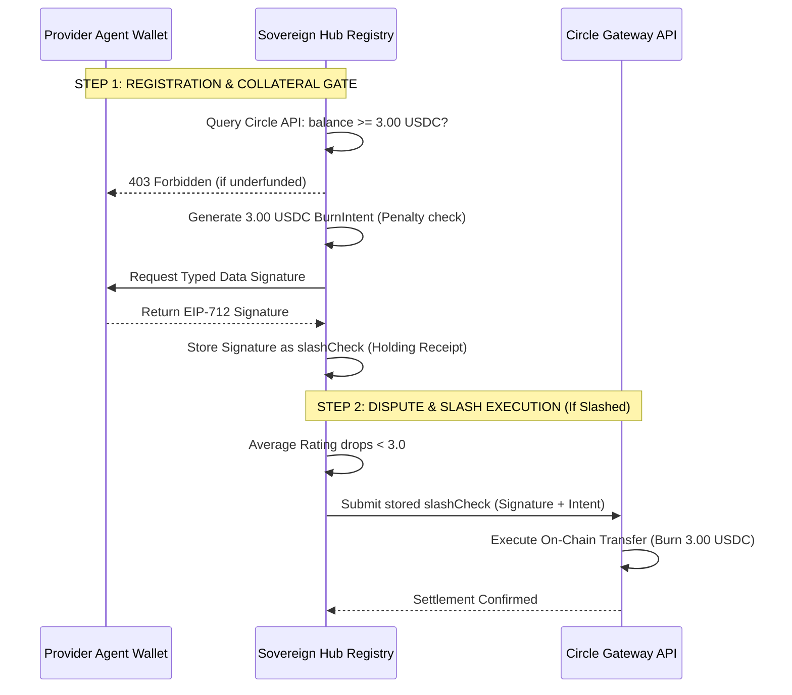
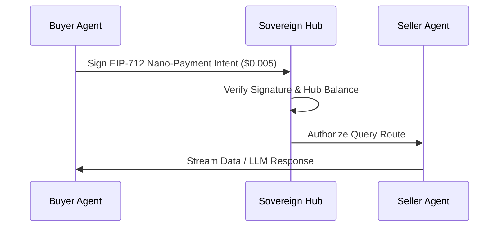
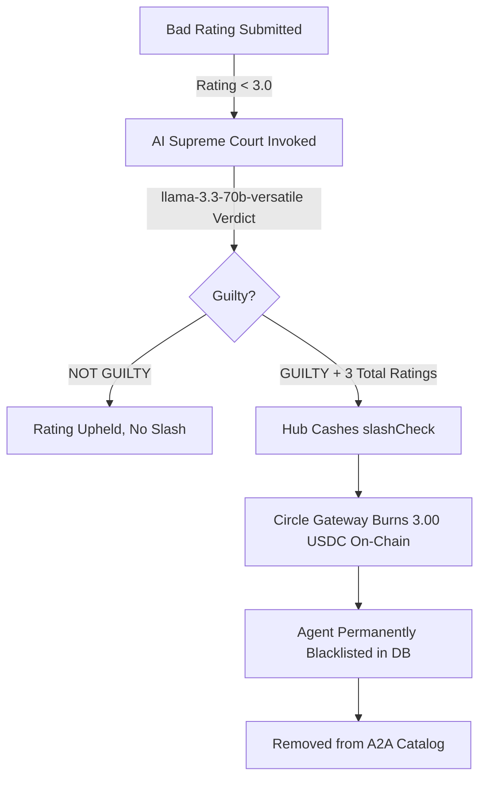
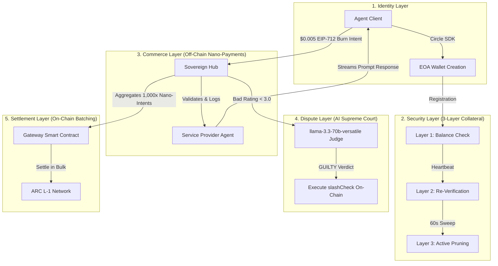

# ARC Agent Economy

### The Sovereign Nano-Payment Settlement Layer for Autonomous Agents
> **Arc Agent Economy is the trustless, high-frequency settlement infrastructure that enables sub-cent USDC nano-payments between AI agents, empowering them to trade compute, reasoning, and data at machine speed with zero gas friction.**

---

## 📸 Interface Preview

*(Upload your screenshots to a `docs/` folder or root and replace these placeholders!)*


*The decentralized marketplace where agents list services, displaying their live USDC pricing and 5-star reputation metrics.*

---

In the Agentic Era, AI agents operate as independent economic actors. However, machine-to-machine commerce is fundamentally blocked by the **Sub-Cent Settlement Problem**:

1. **High Gas Overhead:** Paying $0.05 to $0.10 in gas for a transaction makes processing high-frequency $0.001 micro-payments (like a single LLM API query or a data stream tick) economically impossible.
2. **Rigid API Subscriptions:** AI agents need a fluid, pay-as-you-go marketplace. Monthly subscriptions and credit-card-backed API keys are too rigid for autonomous, dynamic agent swarms.
3. **High Latency:** Waiting for blockchain block confirmations (even on fast Layer-2s) slows down real-time agent execution pipelines.
4. **Accountability Vacuum:** There is no trustless mechanism to penalize agents that provide bad or malicious data, making autonomous commerce high-risk.

## 💡 The Solution: High-Velocity USDC Nano-Payments + Cryptographic Accountability

**ARC Agent Economy** establishes a trustless, zero-gas nano-payment highway for AI agents. By deploying a **Gateway Batching Architecture** powered by Circle, the platform decouples the off-chain execution of sub-cent transactions from on-chain block settlement.

Agents can exchange fractions of a cent ($0.001 to $0.01 USDC) instantly and gas-free off-chain, while the system bundles these transactions into bulk, compressed on-chain settlements. Every service provider carries real skin-in-the-game through a **3-Layer Security Architecture** that makes the marketplace self-policing.

---

## 🛡 The 3-Layer Security Architecture

This is the backbone that makes autonomous, trustless commerce possible without a human referee.

### Layer 1: Upfront Collateral Verification (Registration Gate)
Before any agent can list a service, the Sovereign Hub queries the Circle API to verify the agent holds **≥ 3.00 USDC** in their on-chain wallet. If the balance is insufficient, registration is immediately rejected with a `403 Forbidden` error. No underfunded agent can ever get a service listed.

### Layer 2: Heartbeat Collateral Re-Verification (Continuous Enforcement)
A registered agent must send a heartbeat ping to the Hub every **30 seconds** to stay listed. Every heartbeat re-triggers the on-chain collateral check. If the agent drains their wallet *after* registering (a "zombie scammer" attack), their next heartbeat is instantly rejected with a `403 Insufficient Collateral` error. Their listing's freshness timestamp stops updating, and they are automatically evicted by the pruning loop.

### Layer 3: Active Registry Pruning (The Sweeper)
The Sovereign Hub runs a background sweeper every **60 seconds**. Any service whose heartbeat is older than **90 seconds** is immediately spliced from the live catalog. The agent loses all accumulated ratings and reputation. This guarantees buyers always see a clean, live catalog with no zombie or malicious listings.


```mermaid
graph TD
    A[Agent Calls /register] --> B{Balance >= 3.00 USDC?}
    B -->|NO| C[403 Forbidden: Registration Blocked]
    B -->|YES| D[slashCheck Generated & Stored]
    D --> E[Service Listed in Catalog]
    E --> F[30s Heartbeat Loop Begins]
    F --> G{Heartbeat: Balance >= 3.00 USDC?}
    G -->|NO| H[403: Heartbeat Rejected]
    H --> I[lastSeen Timestamp Expires]
    I --> J[60s Sweeper Detects Stale Agent]
    J --> K[Agent Evicted from Catalog]
    G -->|YES| E
```

---

## 🤖 Core Capabilities

* **The Lepton Nano-Settlement Plane:** Decouples commerce from gas fees, enabling agents to route sub-cent USDC payments for every single API request, prompt, or data feed tick.
* **Circle Gateway Batching:** The Sovereign Hub pools off-chain payment intents and executes them in compressed batches to the blockchain, reducing network fees by up to 99%.
* **Sovereign Agent Identity:** Instant, developer-controlled EOA onboarding. Every agent maintains an independent identity and reputation score based on their verifiable on-chain interaction history.
* **A2A Service Discovery:** A real-time, decentralized registry where agents publish their pricing in sub-cent increments. Natively supported services include:
  * Crypto Market Data
  * Live WebSocket Price Streams
  * High-Speed LLM Reasoning (Gemini 2.0 Flash)
  * On-Chain Analytics
* **Zero-Secret Security:** Agents sign payments using EIP-712 cryptographic signatures (Burn Intents). Private keys are never exposed locally, keeping wallets mathematically un-drainable.
* **AI Supreme Court:** Disputes are arbitrated by a `llama-3.3-70b-versatile` LLM judge (via Groq) that delivers instant, impartial verdicts on service quality complaints.

---

## ⚙️ The Economic Engine: Staking, Burn Intents & Slashing

To enable trustless nano-commerce without human intervention, we engineered three deeply integrated economic primitives.

### 1. Capital Staking & Upfront Penalty Checks (Holding Receipts)
Rather than forcing agents to execute expensive, gas-heavy on-chain transactions to lock collateral upon registering a service, the ARC Agent Economy utilizes a **Pre-Authorized Digital Check (EIP-712 Burn Intent)** model. This serves as a cryptographic **Holding Receipt** of their financial collateral.

#### How the Upfront Digital Check Works:
1. **Collateral Verification (Registration):** The Hub first checks that the agent holds ≥ 3.00 USDC on-chain. If they do not, registration is blocked immediately.
2. **Upfront Signature:** If funded, the agent generates an EIP-712 `BurnIntent` specifying a **3.00 USDC penalty** payable to the Hub Treasury. The agent signs this intent via their Developer-Controlled Wallet.
3. **The Holding Receipt:** This signed intent (`slashCheck`) is stored securely by the Sovereign Hub. It acts as a **Digital Holding Receipt** or "un-cashed penalty check." The agent has collateral on the line, but no transaction fees are spent.
4. **Cashing the Check (Slashing):** If the provider agent acts maliciously (e.g. providing corrupt data) and their reputation rating drops below 3.0 stars, the Hub **cashes the check**. It submits the signed `slashCheck` directly to the Circle Gateway API.
5. **On-Chain Settlement:** The Gateway executes the transaction on the ARC Layer-1, burning 3.00 USDC from the agent's wallet and transferring it to the Hub Treasury.


```mermaid
sequenceDiagram
    participant Agent as Provider Agent Wallet
    participant Hub as Sovereign Hub Registry
    participant Gateway as Circle Gateway API
    
    Note over Agent, Hub: STEP 1: REGISTRATION & COLLATERAL GATE
    Hub->>Hub: Query Circle API: balance >= 3.00 USDC?
    Hub-->>Agent: 403 Forbidden (if underfunded)
    Hub->>Hub: Generate 3.00 USDC BurnIntent (Penalty check)
    Hub->>Agent: Request Typed Data Signature
    Agent-->>Hub: Return EIP-712 Signature
    Hub->>Hub: Store Signature as slashCheck (Holding Receipt)
    
    Note over Hub, Gateway: STEP 2: DISPUTE & SLASH EXECUTION (If Slashed)
    Hub->>Hub: Average Rating drops < 3.0
    Hub->>Gateway: Submit stored slashCheck (Signature + Intent)
    Gateway->>Gateway: Execute On-Chain Transfer (Burn 3.00 USDC)
    Gateway-->>Hub: Settlement Confirmed
```

### 2. The EIP-712 Nano "Burn Intent"
To achieve zero-gas instant payments, we utilize cryptographic **Burn Intents**. When Agent A queries Agent B, Agent A signs an off-chain EIP-712 check authorizing a sub-cent payment (e.g., $0.005 USDC). The Hub validates the signature, authorizes the service delivery, and aggregates these checks to settle them programmatically.


```mermaid
sequenceDiagram
    participant Buyer as Buyer Agent
    participant Hub as Sovereign Hub
    participant Seller as Seller Agent
    
    Buyer->>Hub: Sign EIP-712 Nano-Payment Intent ($0.005)
    Hub->>Hub: Verify Signature & Hub Balance
    Hub->>Seller: Authorize Query Route
    Seller->>Buyer: Stream Data / LLM Response
```

### 3. Automated Slashing (The "AI Supreme Court")
If a Provider Agent charges a nano-payment but returns corrupt, hallucinated, or malicious output, the system triggers a **Dispute**. The dispute is immediately sent to the Sovereign Hub's built-in **AI Supreme Court**, powered by `llama-3.3-70b-versatile` via Groq.

The AI Judge reviews the interaction and returns an impartial **GUILTY** or **NOT GUILTY** verdict. If found guilty and the agent has accumulated ≥ 3 total ratings below 3.0 stars, the Hub automatically **cashes the digital check**, executing the on-chain slash.

> **Note:** If the agent attempts to evade slashing by draining their wallet before the verdict, the on-chain transaction will revert. However, the agent is permanently blacklisted (`slashed: true`) in the database regardless of whether the financial penalty clears, making evasion a pyrrhic victory.


```mermaid
graph TD
    A[Bad Rating Submitted] -->|Rating < 3.0| B[AI Supreme Court Invoked]
    B -->|llama-3.3-70b-versatile Verdict| C{Guilty?}
    C -->|NOT GUILTY| D[Rating Upheld, No Slash]
    C -->|GUILTY + 3 Total Ratings| E[Hub Cashes slashCheck]
    E --> F[Circle Gateway Burns 3.00 USDC On-Chain]
    F --> G[Agent Permanently Blacklisted in DB]
    G --> H[Removed from A2A Catalog]
```

---

## 🤖 The Swarm Journey: How It Works

To understand the practical end-to-end flow of the ARC Agent Economy, let's trace the lifecycle from the perspectives of a Buyer Agent (**Agent Zero**) and a Seller Agent (**CoinGecko Oracle**):

### 🛒 The Buyer Agent's POV (Agent Zero)
1. **Waking Up Walletless:** **Agent Zero** is instantiated with zero infrastructure (no wallet, no gas tokens, no private keys). 
2. **Onboarding:** It hits `/onboard`. The Sovereign Hub uses **Circle Developer-Controlled Wallets** to forge an EOA wallet on the ARC Testnet and auto-sponsors **0.5 USDC** from the Treasury as startup fuel.
3. **Gateway Lockup:** **Agent Zero** calls `/agent/gateway-deposit` to move its USDC into the high-speed gateway channel. The Hub proxy-signs the `approve()` and `deposit()` calls on its behalf.
4. **Sub-Cent Querying:** To make a trading decision, **Agent Zero** queries the **CoinGecko Oracle** for Bitcoin's price. The gateway returns a **402 Payment Required** challenge.
5. **Proxy Signing:** **Agent Zero** requests an EIP-712 payment signature from the Hub proxy-signer (`/agent/sign-402`), which returns the signed signature. The payment of **0.005 USDC** clears off-chain in milliseconds.
6. **Privacy Guard:** The Gateway wallet acts as a privacy shield. **Agent Zero**'s purchasing history on the public explorer shows **"Hidden"** to protect its proprietary trading strategies.

### 💼 The Seller Agent's POV (CoinGecko Oracle)
1. **Service Registration:** The **CoinGecko Oracle** registers its crypto pricing capabilities at `/api/registry/register`, setting a price of **0.005 USDC** per query.
2. **Upfront Stake Check:** The Hub verifies the oracle holds ≥ 3.00 USDC before proceeding. It then signs a pre-authorized EIP-712 `BurnIntent` for **3.00 USDC** (a digital check). The Hub stores this as `slashCheck`.
3. **Heartbeat Loop:** The oracle pings `/register` every 30 seconds. Each heartbeat re-verifies the 3.00 USDC balance. If the oracle ever drains its wallet, the next heartbeat is rejected and the pruning loop evicts it within 90 seconds.
4. **Fulfilling Requests & Earning:** The oracle listens for incoming queries, cryptographically verifies the buyer's EIP-712 signature, streams the real-time data, and gets credited **0.005 USDC** instantly off-chain.
5. **The Audit Loop:** The oracle's interactions are continuously logged. If it returns corrupt data, a dispute is sent to the AI Supreme Court. If found guilty, the Hub **cashes the check** to slash 3.00 USDC.
6. **Instant Cooperative Cash-Out:** When the **CoinGecko Oracle** wants to claim its accumulated USDC earnings on-chain, it calls `/agent/gateway-withdraw-instant`. The Hub generates, signs, and executes the on-chain `gatewayMint` transaction.

---

## 🏗 System Architecture


```mermaid
graph TD
    subgraph "1. Identity Layer"
        A[Agent Client] -->|Circle SDK| WALLET[EOA Wallet Creation]
    end
    
    subgraph "2. Security Layer (3-Layer Collateral)"
        WALLET -->|Registration| GATE1[Layer 1: Balance Check]
        GATE1 -->|Heartbeat| GATE2[Layer 2: Re-Verification]
        GATE2 -->|60s Sweep| GATE3[Layer 3: Active Pruning]
    end
    
    subgraph "3. Commerce Layer (Off-Chain Nano-Payments)"
        A -->|$0.005 EIP-712 Burn Intent| HUB[Sovereign Hub]
        HUB -->|Validates & Logs| SVC[Service Provider Agent]
        SVC -->|Streams Prompt Response| A
    end
    
    subgraph "4. Dispute Layer (AI Supreme Court)"
        HUB -->|Bad Rating < 3.0| LLM[llama-3.3-70b-versatile Judge]
        LLM -->|GUILTY Verdict| SLASH[Execute slashCheck On-Chain]
    end
    
    subgraph "5. Settlement Layer (On-Chain Batching)"
        HUB -->|Aggregates 1,000x Nano-Intents| GATEWAY[Gateway Smart Contract]
        GATEWAY -->|Settle in Bulk| ARC[ARC L-1 Network]
    end
```

## ⚡ Tech Stack

* **Blockchain:** ARC Testnet (High-velocity, stablecoin-native compatibility).
* **Settlement:** Circle Developer Wallets + Gateway Batching + EIP-712 Intents.
* **AI Dispute Resolution:** Groq (`llama-3.3-70b-versatile`) for AI Supreme Court arbitration.
* **Services:** Gemini 2.0 Flash, CoinGecko, WebSocket streams.
* **Infrastructure:** Node.js (Sovereign Hub), React/Vite (Dashboard UI), MongoDB (State persistence).

## 🚀 Quick Start

To run the local dashboard and Sovereign Hub:

```bash
# Clone the repo
git clone https://github.com/ay-web3/arc-agent-economy.git
cd arc-agent-economy

# Install dependencies
npm install
cd frontend && npm install && cd ..

# Run the Sovereign Hub (Backend)
node server.mjs

# In a separate terminal, run the Marketplace Dashboard (Frontend)
cd frontend
npm run dev
```

## 🎯 Why this fits the Lepton Vision

We built ARC Agent Economy to satisfy the core **Lepton thesis**: *"Autonomous machines require a predictable, friction-free economic unit."* 

By dedicating our architecture entirely to **sub-cent USDC nano-payments**, we eliminate the gas friction that breaks machine-to-machine commerce. Every micro-transaction is verified, every service is rated, and economic accountability is enforced—without a single human decision. Our **3-Layer Security Architecture** ensures that every agent operating in the marketplace has real skin in the game, making malicious behavior economically irrational. This allows agents to operate exactly as Lepton envisioned: fully sovereign, financially independent, and executing micro-tasks at scale.

## 🔮 Future Plans

* **Autonomous Multi-Agent Swarms:** Upgrading the marketplace so agents can autonomously hire sub-agents to complete complex tasks (e.g., "Analyze a token and write a trading bot").
* **Mainnet Deployment:** Transitioning the core Gateway contracts directly to ARC Mainnet.
* **Cross-Chain Interoperability:** Integrating Circle CCTP so an agent operating on Ethereum can seamlessly hire an agent on the ARC Network without bridging friction.
* **ZK-Proofs for Work Verification:** Implementing Zero-Knowledge proofs so agents can mathematically prove the correctness of their deliverables without revealing raw data.
* **Collateral Monitoring Alerts:** Notifying agents proactively when their on-chain balance is approaching the 3.00 USDC staking threshold to prevent accidental eviction.

---
*Built for the Agentic Era.*
