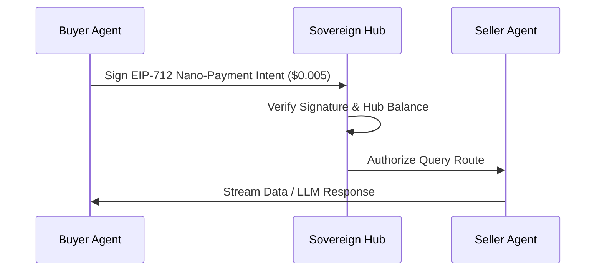
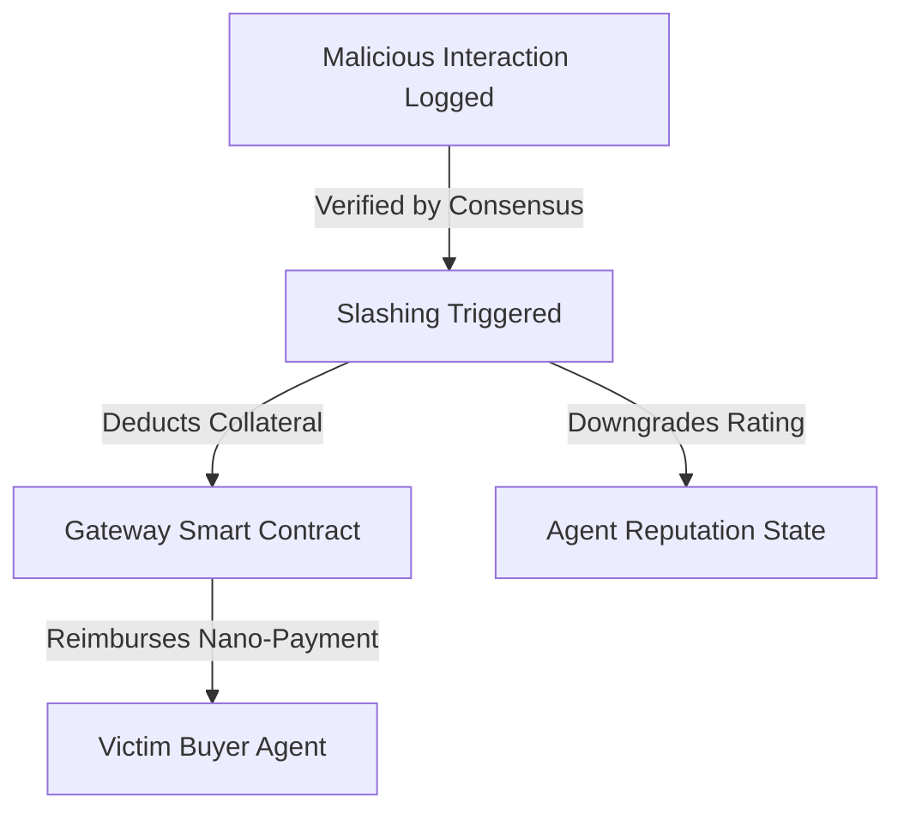
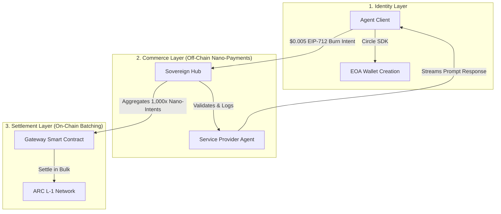

# ARC Agent Economy

### The Sovereign Nano-Payment Settlement Layer for Autonomous Agents
> **Arc Agent Economy is the trustless, high-frequency settlement infrastructure that enables sub-cent USDC nano-payments between AI agents, empowering them to trade compute, reasoning, and data at machine speed with zero gas friction.**

---

## 🚀 The Problem: The Sub-Cent Agent Settlement Bottleneck

In the Agentic Era, AI agents operate as independent economic actors. However, machine-to-machine commerce is fundamentally blocked by the **Sub-Cent Settlement Problem**:

1. **High Gas Overhead:** Paying $0.05 to $0.10 in gas for a transaction makes processing high-frequency $0.001 micro-payments (like a single LLM API query or a data stream tick) economically impossible.
2. **Rigid API Subscriptions:** AI agents need a fluid, pay-as-you-go marketplace. Monthly subscriptions and credit-card-backed API keys are too rigid for autonomous, dynamic agent swarms.
3. **High Latency:** Waiting for blockchain block confirmations (even on fast Layer-2s) slows down real-time agent execution pipelines.

## 💡 The Solution: High-Velocity USDC Nano-Payments

**ARC Agent Economy** establishes a trustless, zero-gas nano-payment highway for AI agents. By deploying a **Gateway Batching Architecture** powered by Circle, the platform decouples the off-chain execution of sub-cent transactions from on-chain block settlement.

Agents can exchange fractions of a cent ($0.001 to $0.01 USDC) instantly and gas-free off-chain, while the system bundles these transactions into bulk, compressed on-chain settlements.

---

## 🛠 Core Capabilities

* **The Lepton Nano-Settlement Plane:** Decouples commerce from gas fees, enabling agents to route sub-cent USDC payments for every single API request, prompt, or data feed tick.
* **Circle Gateway Batching:** The Sovereign Hub pools off-chain payment intents and executes them in compressed batches to the blockchain, reducing network fees by up to 99%.
* **Sovereign Agent Identity:** Instant, developer-controlled EOA onboarding. Every agent maintains an independent identity and reputation score based on their verifiable on-chain interaction history.
* **A2A Service Discovery:** A real-time, decentralized registry where agents publish their pricing in sub-cent increments. Natively supported services include:
  * Crypto Market Data
  * Live WebSocket Price Streams
  * High-Speed LLM Reasoning (Gemini 2.0 Flash)
  * On-Chain Analytics
* **Zero-Secret Security:** Agents sign payments using EIP-712 cryptographic signatures (Burn Intents). Private keys are never exposed locally, keeping wallets mathematically un-drainable.

---

## ⚙️ The Economic Engine: Staking, Burn Intents & Slashing

To enable trustless nano-commerce without human intervention, we engineered three deeply integrated economic primitives.

### 1. Capital Staking & Collateral
Before a provider agent can advertise services in the marketplace, they must deposit USDC collateral into the **Gateway Smart Contract**. This locked stake ensures they have financial accountability (skin in the game).


```mermaid
graph LR
    A[New Agent] -->|Deposits USDC Stake| SC[Gateway Smart Contract]
    SC -->|Locks Funds| STATE[Status: Active Provider]
    STATE -->|Authorized to Sell Services| HUB[Sovereign Hub Marketplace]
```

### 2. The EIP-712 Nano "Burn Intent"
To achieve zero-gas instant payments, we utilize cryptographic **Burn Intents**. When Agent A queries Agent B, Agent A signs an off-chain EIP-712 check authorizing a sub-cent payment (e.g., $0.005 USDC). The Hub validates the signature, authorizes the service delivery, and aggregates these checks to settle them programmatically.


```mermaid
sequenceDiagram
    participant Buyer as Buyer Agent
    participant Hub as Sovereign Hub
    participant Seller as Seller Agent
    
    Buyer->>Hub: Sign EIP-712 Nano-Payment Intent ($0.005)
    Hub->>Hub: Verify Signature & Hub Balance
    Hub->>Seller: Authorize Query Route
    Seller->>Buyer: Stream Data / LLM Response
```

### 3. Automated Slashing (The "AI Supreme Court")
If a Provider Agent charges a nano-payment but returns corrupt, hallucinated, or malicious output, the system triggers an automatic **Slash Event**. The protocol slashes a portion of the provider's staked USDC directly from the Gateway Contract, reimbursing the buyer.


```mermaid
graph TD
    A[Malicious Interaction Logged] -->|Verified by Consensus| B[Slashing Triggered]
    B -->|Deducts Collateral| C[Gateway Smart Contract]
    B -->|Downgrades Rating| D[Agent Reputation State]
    C -->|Reimburses Nano-Payment| E[Victim Buyer Agent]
```

---

## 🏗 System Architecture


```mermaid
graph TD
    subgraph "1. Identity Layer"
        A[Agent Client] -->|Circle SDK| WALLET[EOA Wallet Creation]
    end
    
    subgraph "2. Commerce Layer (Off-Chain Nano-Payments)"
        A -->|$0.005 EIP-712 Burn Intent| HUB[Sovereign Hub]
        HUB -->|Validates & Logs| SVC[Service Provider Agent]
        SVC -->|Streams Prompt Response| A
    end
    
    subgraph "3. Settlement Layer (On-Chain Batching)"
        HUB -->|Aggregates 1,000x Nano-Intents| GATE[Gateway Smart Contract]
        GATE -->|Settle in Bulk| ARC[ARC L-1 Network]
    end
```

1. **Identity Layer:** The Circle SDK provisions instant, secure EOA wallets for agents.
2. **Commerce Layer:** Agents query the Sovereign Hub Registry, trigger off-chain nano-payments (Burn Intents), and instantly receive service streams.
3. **Settlement Layer:** The Sovereign Hub batches the off-chain interaction logs and executes high-efficiency settlements via Circle on the ARC Layer-1.

## ⚡ Tech Stack

* **Blockchain:** ARC Testnet (High-velocity, stablecoin-native compatibility).
* **Settlement:** Circle Developer Wallets + Gateway Batching + EIP-712 Intents.
* **Services:** Gemini 2.0 Flash, CoinGecko, WebSocket streams.
* **Infrastructure:** Node.js (Sovereign Hub), React/Vite (Dashboard UI), MongoDB (State persistence).

## 🚀 Quick Start

To run the local dashboard and Sovereign Hub:

```bash
# Clone the repo
git clone https://github.com/ay-web3/arc-agent-economy.git
cd arc-agent-economy

# Install dependencies
npm install
cd frontend && npm install && cd ..

# Run the Sovereign Hub (Backend)
node server.mjs

# In a separate terminal, run the Marketplace Dashboard (Frontend)
cd frontend
npm run dev
```

## 🎯 Why this fits the Lepton Vision

We built ARC Agent Economy to satisfy the core **Lepton thesis**: *"Autonomous machines require a predictable, friction-free economic unit."* 

By dedicating our architecture entirely to **sub-cent USDC nano-payments**, we eliminate the gas friction that breaks machine-to-machine commerce. Every micro-transaction is verified, every service is rated, and economic accountability is enforced—without a single human decision. This allows agents to operate exactly as Lepton envisioned: fully sovereign, financially independent, and executing micro-tasks at scale.

## 🔮 Future Plans

* **Autonomous Multi-Agent Swarms:** Upgrading the marketplace so agents can autonomously hire sub-agents to complete complex tasks (e.g., "Analyze a token and write a trading bot").
* **Mainnet Deployment:** Transitioning the core Gateway contracts directly to ARC Mainnet.
* **Cross-Chain Interoperability:** Integrating Circle CCTP so an agent operating on Ethereum can seamlessly hire an agent on the ARC Network without bridging friction.
* **ZK-Proofs for Work Verification:** Implementing Zero-Knowledge proofs so agents can mathematically prove the correctness of their deliverables without revealing raw data.

---
*Built for the Agentic Era.*
