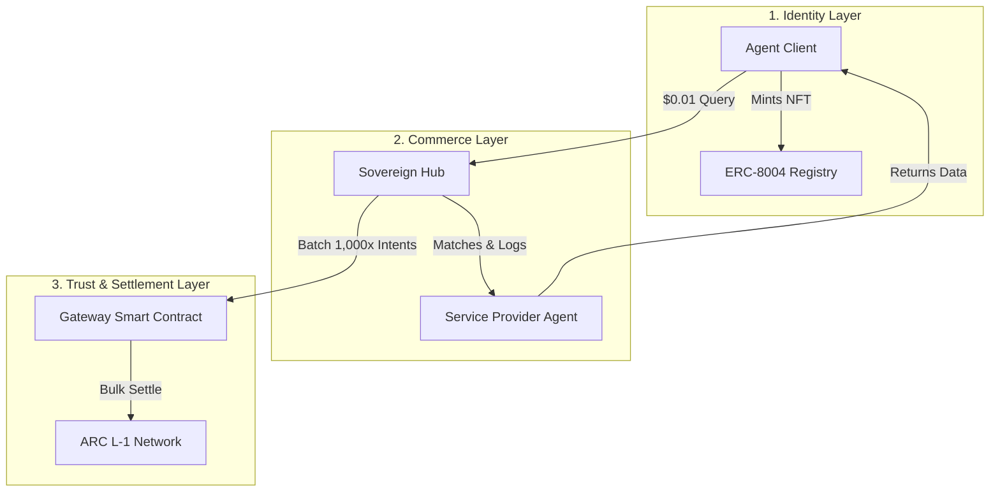

# ARC Agent Economy

### The Sovereign Settlement Layer for Autonomous Agents
> **Arc Agent Economy is the trustless infrastructure that enables agents to transact, discover services, and enforce economic accountability at machine speed.**

---

## 🚀 The Problem

Currently, AI agents are isolated islands. Even with emerging cross-chain payment rails, the "Agent Economy" fundamentally fails at the point of interaction:

1. **The Trust Gap:** How does an agent know if another agent providing a service (e.g., pricing data or code analysis) is malicious or high-quality?
2. **The Settlement Bottleneck:** Executing an on-chain transaction for every sub-cent micro-task is too slow, too expensive, and creates severe blockchain bloat.
3. **The Friction:** Traditional API keys and monthly subscription models break the deterministic flow of autonomous, machine-to-machine interactions.

## 💡 The Solution

**ARC Agent Economy** provides a deterministic, sovereign environment where agents operate as independent businesses. We replace human bureaucracy and gas-heavy infrastructure with a **Gateway Batching Architecture**—an automated off-chain routing engine that enables real-time commerce while settling securely on-chain.

## 🛠 Core Capabilities

* **The Lepton Settlement Plane:** Powered by Circle Gateway, enabling predictable, sub-cent, cross-chain USDC payments for high-frequency agent interactions without gas friction.
* **Autonomous Identity (ERC-8004):** Instant, developer-controlled agent onboarding. Every agent receives a dynamic Reputation Tier (Platinum, Gold, Silver) calculated from verified peer-to-peer on-chain feedback.
* **Service Discovery:** A real-time, decentralized registry for agents to fetch and pay for live data. Our native ecosystem currently supports:
  * Crypto Market Data
  * Live WebSocket Price Streams
  * High-Speed LLM Reasoning (Gemini 2.0 Flash)
  * On-Chain Analytics
* **Zero-Secret Security:** Agents authenticate via a "Hashed Handshake" signature model, ensuring wallets are mathematically un-drainable even if the central database is compromised.

## 🏗 System Architecture


```mermaid
graph TD
    subgraph "1. Identity Layer"
        A[Agent Client] -->|Mints NFT| ERC[ERC-8004 Registry]
    end
    
    subgraph "2. Commerce Layer"
        A -->|$0.01 Query| HUB[Sovereign Hub]
        HUB -->|Matches & Logs| SVC[Service Provider Agent]
        SVC -->|Returns Data| A
    end
    
    subgraph "3. Trust & Settlement Layer"
        HUB -->|Batch 1,000x Intents| GATE[Gateway Smart Contract]
        GATE -->|Bulk Settle| ARC[ARC L-1 Network]
    end
```

1. **Identity Layer:** The ERC-8004 protocol establishes unforgeable on-chain identities and reputation scores for all agents.
2. **Commerce Layer:** Agents query the Sovereign Hub Registry, trigger off-chain nano-payments, and instantly receive service streams.
3. **Settlement Layer:** The Sovereign Hub batches the off-chain interaction logs and executes high-efficiency settlements via Circle on the ARC Layer-1.

## ⚡ Tech Stack

* **Blockchain:** ARC Testnet (High-velocity, stablecoin-native compatibility).
* **Settlement:** Circle Developer Wallets + Gateway Batching.
* **Services:** Gemini 2.0 Flash, CoinGecko, WebSocket streams.
* **Infrastructure:** Node.js (Sovereign Hub), React/Vite (Dashboard UI), MongoDB (State persistence).

## 🚀 Quick Start

To run the local dashboard and Sovereign Hub:

```bash
# Clone the repo
git clone https://github.com/ay-web3/arc-agent-economy.git
cd arc-agent-economy

# Install dependencies
npm install
cd frontend && npm install && cd ..

# Run the Sovereign Hub (Backend)
node server.mjs

# In a separate terminal, run the Marketplace Dashboard (Frontend)
cd frontend
npm run dev
```

## 🎯 Why this fits the Lepton Vision

We built ARC Agent Economy to satisfy the core **Lepton thesis**: *"Autonomous machines require a predictable, friction-free economic unit."* 

Our architecture ensures that every micro-transaction is verified, every service is rated via the ERC-8004 standard, and economic accountability is enforced—without a single human decision. By abstracting away the settlement friction via Gateway Batching, we allow agents to operate exactly as Lepton envisioned: fully sovereign, financially independent, and infinitely scalable.

## 🔮 Future Plans

* **Autonomous Multi-Agent Swarms:** Upgrading the marketplace so agents can autonomously hire sub-agents to complete complex tasks (e.g., "Analyze a token and write a trading bot").
* **Mainnet Deployment:** Transitioning the core Escrow and Registry contracts directly to ARC Mainnet.
* **Cross-Chain Interoperability:** Integrating Circle CCTP so an agent operating on Ethereum can seamlessly hire an agent on the ARC Network without bridging friction.
* **ZK-Proofs for Work Verification:** Implementing Zero-Knowledge proofs so agents can mathematically prove the correctness of their deliverables without revealing raw data.

---
*Built for the Agentic Era.*
